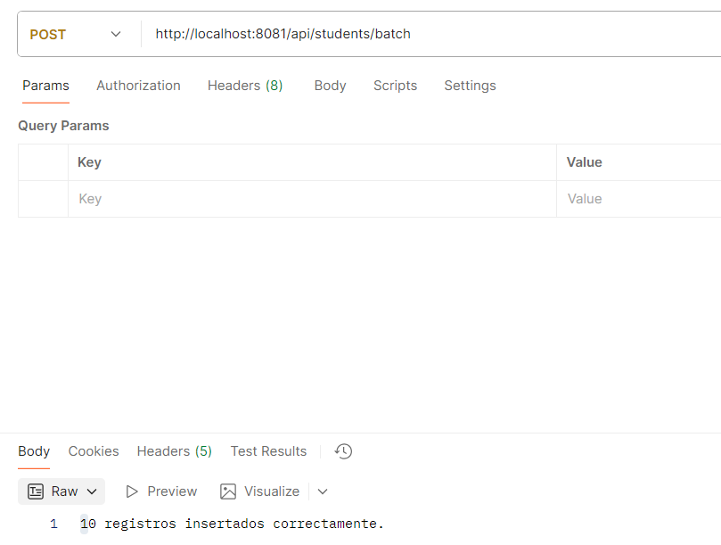
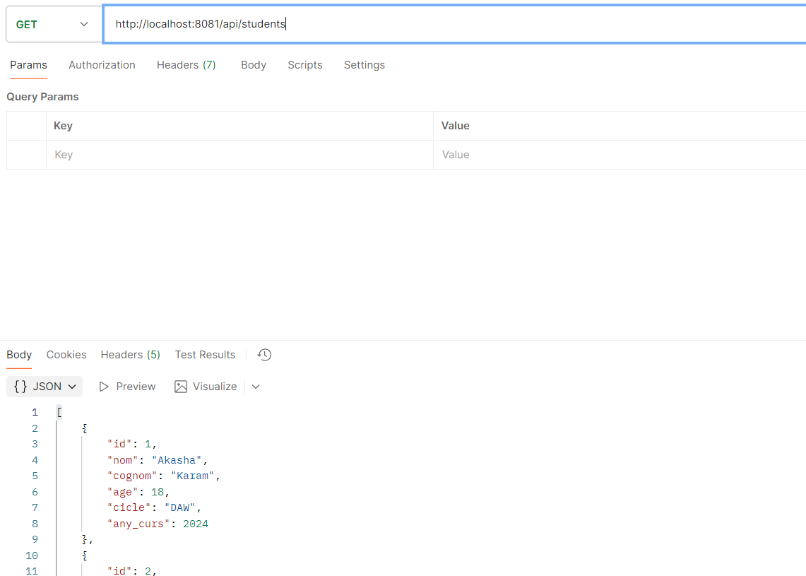

# Activitat 1

Es un endpoint de tipo GET que sirve para recoger todos los alumnos que tenemos en la base de datos. Hace una consulta a la tabla students y convierte cada fila en un objeto de tipo student. Al final, devuelve una lista con todos los alumnos, para que el usuario o la aplicación puedan verlos cuando llamen a este endpoint.

Este endpoint sirve para añadir en la base de datos alumnos. Recorre esa lista de alumnos y va insertando cada uno en la tabla students. Cada vez que inserta un alumno, suma uno al contador. Al final, devuelve cuántos alumnos se han guardado correctamente. 

